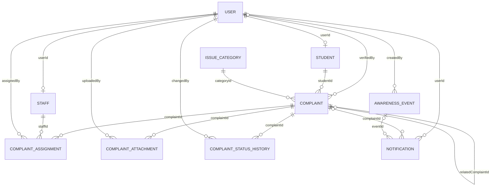

# Database schema

The backend uses MongoDB through Mongoose. Each model is stored in its pluralized collection name. Mongoose adds `_id`, `createdAt`, and `updatedAt` to each document unless stated otherwise. References below are MongoDB `ObjectId` values; Mongoose `ref` values support population but do not create MongoDB-enforced foreign keys.

## Relationship overview

## Collections

### `users` — `User`

| Field | Type | Rules / purpose |
|---|---|---|
| `role` | String | Required; `student`, `admin`, or `staff` |
| `email` | String | Optional, unique sparse index, lowercase and trimmed |
| `passwordHash` | String | Required; bcrypt hash |
| `isActive` | Boolean | Defaults to `true` |

### `students` — `Student`

| Field | Type | Rules / purpose |
|---|---|---|
| `userId` | ObjectId → `User` | Required, unique |
| `rollNumber` | String | Required, unique, uppercase and trimmed |
| `name` | String | Required |
| `department` | String | Required |
| `year` | Number | 1–5 |
| `phone` | String | Optional |
| `points` | Number | Defaults to `0` |

### `staffs` — `Staff`

| Field | Type | Rules / purpose |
|---|---|---|
| `userId` | ObjectId → `User` | Required, unique |
| `employeeCode` | String | Required, unique, uppercase |
| `name` | String | Required |
| `phone`, `department` | String | Optional |
| `skills` | String[] | Staff capabilities used for assignment matching |
| `isAvailable` | Boolean | Defaults to `true` |

### `issuecategories` — `IssueCategory`

| Field | Type | Rules / purpose |
|---|---|---|
| `name` | String | Required, unique |
| `requiredSkill` | String | Optional assignment skill |
| `defaultPriority` | String | `Low`, `Medium`, or `High`; defaults to `Medium` |
| `isActive` | Boolean | Defaults to `true` |

### `complaints` — `Complaint`

| Field | Type | Rules / purpose |
|---|---|---|
| `studentId` | ObjectId → `Student` | Required reporter |
| `categoryId` | ObjectId → `IssueCategory` | Required |
| `description` | String | Required, 10–1000 characters |
| `status` | String | `Reported`, `Verified`, `Rejected`, `Assigned`, `In Progress`, `Overdue`, `Unable to Resolve`, `Reassigned`, `Deadline Extended`, `Resolved`, `Closed`, or `Repetitive`; defaults to `Reported` |
| `priority` | String | `Low`, `Medium`, or `High`; defaults to `Medium` |
| `tokenId` | String | Optional; unique sparse index, generated at verification |
| `idempotencyKey` | String | Optional; unique sparse index, prevents duplicate creates after mobile retries |
| `latitude`, `longitude` | Number | Required location snapshot |
| `gpsAccuracy` | Number | Required, minimum 0 |
| `locationVerified` | Boolean | Defaults to `false` |
| `locationDescription` | String | Required landmark, 2–200 characters |
| `rejectionReason` | String | Optional administrator explanation |
| `verifiedAt` | Date | Optional |
| `verifiedBy` | ObjectId → `User` | Optional administrator reference |
| `imageValidation` | Object | `{ isRelevant: Boolean, confidence: Number, level: HIGH\|MEDIUM\|LOW, reason: String, flaggedForReview: Boolean }` |
| `relatedComplaintId` | ObjectId → `Complaint` | Optional canonical issue for repetitive reports |
| `isRepetitive` | Boolean | Defaults to `false` |
| `duplicateSuppressed` | Boolean | Defaults to `false`; same-reporter retries are excluded from RCA |
| `repetitiveCount` | Number | Defaults to `0`; number of linked reports |
| `repetitiveReason` | String | Optional matching/audit explanation |
| `repetitiveConfidence` | Number | Optional, 0–1 similarity score |

Indexes: `{ studentId: 1, status: 1 }`, `{ categoryId: 1, status: 1, latitude: 1, longitude: 1 }`, plus unique sparse indexes for `tokenId` and `idempotencyKey`.

### `complaintassignments` — `ComplaintAssignment`

Assignments are separate documents so reassignment history and deadlines can be retained.

| Field | Type | Rules / purpose |
|---|---|---|
| `complaintId` | ObjectId → `Complaint` | Required |
| `staffId` | ObjectId → `Staff` | Required assignee |
| `assignedBy` | ObjectId → `User` | Required administrator |
| `deadline` | Date | Required |
| `isActive` | Boolean | Defaults to `true` |
| `resolvedAt` | Date | Optional completion time |
| `unableToResolveReason` | String | Optional staff explanation |
| `status` | String | `Active`, `Resolved`, `Unable to Resolve`, or `Reassigned`; defaults to `Active` |
| `deadlineExtensions` | Object[] | `{ oldDeadline, newDeadline, reason, extendedBy → User, extendedAt }` |

Index: `{ complaintId: 1, isActive: 1 }`.

### `complaintattachments` — `ComplaintAttachment`

Photo files live on the backend filesystem; documents store their metadata and URL.

| Field | Type | Rules / purpose |
|---|---|---|
| `complaintId` | ObjectId → `Complaint` | Required |
| `fileUrl` | String | Required relative upload URL |
| `fileName` | String | Optional stored filename |
| `mimeType` | String | Optional content type |
| `sizeBytes` | Number | Optional file size |
| `attachmentType` | String | Required; `complaint_photo` or `resolution_photo` |
| `uploadedBy` | ObjectId → `User` | Required uploader |

Index: `{ complaintId: 1, attachmentType: 1 }`.

### `complaintstatushistories` — `ComplaintStatusHistory`

| Field | Type | Rules / purpose |
|---|---|---|
| `complaintId` | ObjectId → `Complaint` | Required |
| `status` | String | Required status snapshot |
| `changedBy` | ObjectId → `User` | Required actor |
| `note` | String | Optional audit note |

Index: `{ complaintId: 1, createdAt: 1 }`.

### `notifications` — `Notification`

| Field | Type | Rules / purpose |
|---|---|---|
| `userId` | ObjectId → `User` | Required recipient |
| `complaintId` | ObjectId → `Complaint` | Optional related complaint |
| `eventId` | ObjectId → `AwarenessEvent` | Optional related sustainability event |
| `title`, `message` | String | Required display text |
| `type` | String | Required notification type enum in `Notification.js` |
| `isRead` | Boolean | Defaults to `false` |

Index: `{ userId: 1, isRead: 1, createdAt: -1 }`.

### `awarenessevents` — `AwarenessEvent`

| Field | Type | Rules / purpose |
|---|---|---|
| `title` | String | Required |
| `eventType` | String | Required event enum (`Awareness Campaign`, `Tree Plantation`, `Sustainability Drive`, `Cleanliness Drive`, `Rally`, `Workshop`, `Seminar`, `Environmental Program`, `Other`) |
| `description` | String | Optional |
| `date` | Date | Required |
| `startTime`, `endTime`, `location`, `organizer`, `audience` | String | Optional event details |
| `maxParticipants` | Number | Optional capacity |
| `imageUrl` | String | Optional event image URL |
| `isPublished`, `isCancelled` | Boolean | Defaults to `false` |
| `createdBy` | ObjectId → `User` | Optional creator |

Index: `{ isPublished: 1, isCancelled: 1, date: 1 }`.

### `priorityrules` — `PriorityRule`

| Field | Type | Rules / purpose |
|---|---|---|
| `categoryName` | String | Required category name |
| `keywords` | String[] | Lowercase matching terms |
| `priority` | String | Required; `Low`, `Medium`, or `High` |
| `weight` | Number | Defaults to `1` |

## Data notes

- MongoDB does not enforce the `ref` relationships as foreign keys. The API is responsible for access checks and maintaining related records.
- Complaint and resolution images are stored under `backend/uploads`; `ComplaintAttachment` holds their database metadata.
- Duplicate matching requires the same category, normalized room/landmark text, nearby GPS coordinates, and similar descriptions. Reports in separate rooms or labs remain separate issues.
- The RCA dashboard computes its recommendation from complaint category, location, description, status, and repeat history; it is not stored as a separate collection.
- The schema describes the Mongoose models currently in `backend/src/models`.
